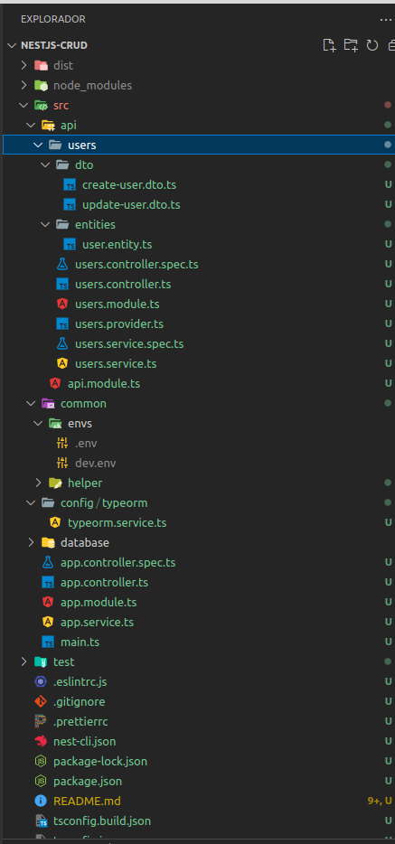
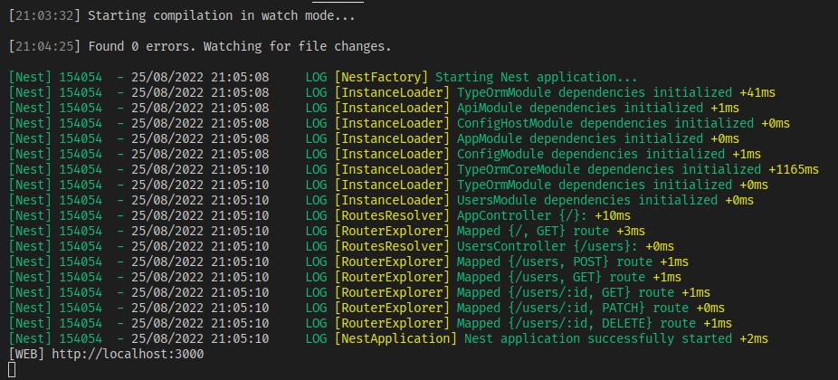
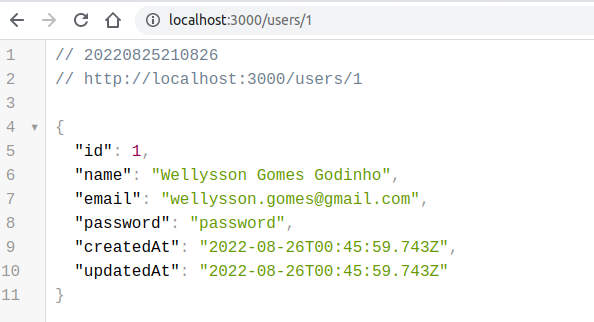

# NestJS with TypeORM and Postgres

<p align="center">
  <a href="http://nestjs.com/" target="blank"></a>
</p>

[circleci-image]: https://img.shields.io/circleci/build/github/nestjs/nest/master?token=abc123def456
[circleci-url]: https://circleci.com/gh/nestjs/nest

  <p align="center">A progressive <a href="http://nodejs.org" target="_blank">Node.js</a> framework for building efficient and scalable server-side applications.</p>
    <p align="center">
<a href="https://www.npmjs.com/~nestjscore" target="_blank"></a>
<a href="https://www.npmjs.com/~nestjscore" target="_blank"></a>
<a href="https://www.npmjs.com/~nestjscore" target="_blank"></a>
<a href="https://circleci.com/gh/nestjs/nest" target="_blank"></a>
<a href="https://coveralls.io/github/nestjs/nest?branch=master" target="_blank"></a>
<a href="https://discord.gg/G7Qnnhy" target="_blank"></a>
<a href="https://opencollective.com/nest#backer" target="_blank"></a>
<a href="https://opencollective.com/nest#sponsor" target="_blank"></a>
  <a href="https://paypal.me/kamilmysliwiec" target="_blank"></a>
    <a href="https://opencollective.com/nest#sponsor"  target="_blank"></a>
  <a href="https://twitter.com/nestframework" target="_blank"></a>
</p>
  <!--[](https://opencollective.com/nest#backer)
  [](https://opencollective.com/nest#sponsor)-->

## Description

[Nest](https://github.com/nestjs/nest) framework TypeScript starter repository.

## Prerequisites

It’s required to have a basic understanding of [Node.js](https://nodejs.org/), [TypeScript](https://www.typescriptlang.org/), and [PostgreSQL](https://www.postgresql.org/) which you have installed locally on your machine.

## Let’s get started (step by step)

First, we need to create our PostgreSQL database. If you have PostgreSQL installed, the following four commands will run on Linux, Mac, and Windows machines.

```bash
$ psql postgres
$ CREATE DATABASE nest_api;
$ \l
$ \q
```

. `psql postgres` open `psql` CLI with user `postgres`
. `CREATE DATABASE nest_api` creating the database we need
. `\l` list all databases
. `\q` CLI exit

Or you can use a Database administrator

## NestJS Application

#### Setup

Setting up a new project is quite simple with the Nest CLI. With npm installed, you can create a new Nest project with the following commands in your OS terminal:

```bash
- to install the NestJS CLI
$ npm i -g @nestjs/cli

- to initialize a new NestJS project with its CLI
$ nest new nest-crud -p npm
```

After this command is done you can open your project in your code editor. Since I use Visual Studio Code, I gonna open the project by typing:
```bash
$ cd nest-postgres
$ code .
```

#### Git

The next step is optional, but usually, I commit the original initialization, so I gonna type:
```bash
$ git add .
$ git commit -m "chore(): init nestjs"
```

### Dependencies

Let’s install some dependencies we going to need.
```bash
$ npm i @nestjs/config @nestjs/typeorm typeorm pg class-validator class-transformer
$ npm i -D @types/node
```

### Project Structure

Now, let’s start to code. We going to create some folders and files in order to have a clean project structure.
```bash
let’s create some folders.

$ mkdir src/common && mkdir src/common/envs && mkdir src/common/helper
$ mkdir src/config && mkdir src/config/typeorm

let’s create some files.

$ touch src/config/typeorm/typeorm.service.ts
$ touch src/common/envs/.env
$ touch src/common/envs/development.env
$ touch src/common/helper/env.helper.ts
```

In order to have the environment files in our dist/ folder, we need to add a compiler rule to our nest-cli.json.

So please change the nest-cli.json from
```bash
{
  "collection": "@nestjs/schematics",
  "sourceRoot": "src"
}
```
to
```bash
{
  "collection": "@nestjs/schematics",
  "sourceRoot": "src",
  "compilerOptions": {
    "assets": ["common/envs/*"]
  }
}
```

Now let’s modify our src/common/helper/env.helper.ts file, in order to load our environment file when we import our ConfigModule later.
```bash
import { existsSync } from 'fs';
import { resolve } from 'path';

export function getEnvPath(dest: string): string {
  const env: string | undefined = process.env.NODE_ENV;
  const fallback: string = resolve(`${dest}/.env`);
  const filename: string = env ? `${env}.env` : 'development.env';
  let filePath: string = resolve(`${dest}/${filename}`);

  if (!existsSync(filePath)) {
    filePath = fallback;
  }

  return filePath;
}
```

This function returns the absolute path to our environment file based on our `NODE_ENV`. It basically has two fallbacks. First, if `NODE_ENV` is not set, we try to get the absolute path of the `dev.env` file, if this file does not exist, it will return the absolute path to the `.env` file.

Let’s continue with adding some life to our environment files. You can see the file path **src/comon/envs/development.env**. 
```bash
BASE_URL=http://localhost:3000
PORT=3000
TYPEORM_CONNECTION = postgres
TYPEORM_HOST = localhost
TYPEORM_USERNAME = postgres
TYPEORM_PASSWORD = postgres
TYPEORM_DATABASE = code_drops_crud
TYPEORM_PORT = 5432
```
***Notice***: Usually, you don’t push any environment files to your Git repository, except a sample .env file, which shows the structure of our environment files to other contributers.

We created the environment files and the helper file. Now we can implement them into our actual code. In order to do that, we need to add the ConfigModule we have installed at the beginning of this project.

Please change the `src/app.module.ts` from:
```bash
import { Module } from '@nestjs/common';
import { AppController } from './app.controller';
import { AppService } from './app.service';

@Module({
  imports: [],
  controllers: [AppController],
  providers: [AppService],
})
export class AppModule {}
```
to
```bash
import { Module } from '@nestjs/common';
import { ConfigModule } from '@nestjs/config';
import { AppController } from './app.controller';
import { AppService } from './app.service';
import { getEnvPath } from './common/helper/env.helper';

const envFilePath: string = getEnvPath(`${__dirname}/common/envs`);

@Module({
  imports: [ConfigModule.forRoot({ envFilePath, isGlobal: true })],
  controllers: [AppController],
  providers: [AppService],
})
export class AppModule {}
```
***Notice***: that we added the `ConfigModule` globally. That means we do not have to import it every time we need to access the `ConfigService`.

`ConfigModule` and Environment Files are settled now. Let’s continue with our `TypeORM` integration. Remember, we created a file called `typeorm.service.ts` inside `src/config/typeorm/`, let’s add the following content:
```bash
import { Inject, Injectable } from '@nestjs/common';
import { ConfigService } from '@nestjs/config';
import { TypeOrmModuleOptions, TypeOrmOptionsFactory } from '@nestjs/typeorm';

@Injectable()
export class TypeOrmConfigService implements TypeOrmOptionsFactory {
  @Inject(ConfigService)
  private readonly config: ConfigService;

  public createTypeOrmOptions(): TypeOrmModuleOptions {
    return {
      type: 'postgres',
      host: this.config.get<string>('TYPEORM_HOST'),
      port: this.config.get<number>('TYPEORM_PORT'),
      database: this.config.get<string>('TYPEORM_DATABASE'),
      username: this.config.get<string>('TYPEORM_USERNAME'),
      password: this.config.get<string>('TYPEORM_PASSWORD'),
      entities: ['dist/**/*.entity.{ts,js}'],
      migrations: ['dist/database/migrations/*.{ts,js}'],
      migrationsTableName: 'typeorm_migrations',
      logger: 'file',
      synchronize: true, // never use TRUE in production!
    };
  }
}
```
***Warning***: If the property synchronize is true, TypeORM will update any changes of your entities automatically. This is something you should never use in production!

So what’s happening here is, that we `inject` our `ConfigService`, and then based on that `ConfigService`, we pull the database information out from our Environment Variables.

Let’s modify our `src/app.module.ts` file once again, by adding the `TypeOrmModule` together with our `typeorm.service.ts` file we just created.

Please change the `src/app.module.ts` from:

```bash
import { Module } from '@nestjs/common';
import { ConfigModule } from '@nestjs/config';
import { TypeOrmModule } from '@nestjs/typeorm';
import { AppController } from './app.controller';
import { AppService } from './app.service';
import { getEnvPath } from './common/helper/env.helper';
import { TypeOrmConfigService } from './config/typeorm/typeorm.service';

const envFilePath: string = getEnvPath(`${__dirname}/common/envs`);

@Module({
  imports: [ConfigModule.forRoot({ envFilePath, isGlobal: true })],
  controllers: [AppController],
  providers: [AppService],
})
export class AppModule {}
```
to
```bash
import { Module } from '@nestjs/common';
import { ConfigModule } from '@nestjs/config';
import { TypeOrmModule } from '@nestjs/typeorm';
import { AppController } from './app.controller';
import { AppService } from './app.service';
import { getEnvPath } from './common/helper/env.helper';
import { TypeOrmConfigService } from './config/typeorm/typeorm.service';

const envFilePath: string = getEnvPath(`${__dirname}/common/envs`);

@Module({
  imports: [
    ConfigModule.forRoot({ envFilePath, isGlobal: true }),
    TypeOrmModule.forRootAsync({ useClass: TypeOrmConfigService })
  ],
  controllers: [AppController],
  providers: [AppService],
})
export class AppModule {}
```

Next, we going to modify our `src/main.ts` file briefly. What we going to do is, that we get `ConfigService` inside our bootstrap function, where we get the `PORT` and `BASE_URL` information from our active Environment file. Additionally, we add a Global Pipe for better validation.

Please change `src/main.ts` from:
```bash
import { NestFactory } from '@nestjs/core';
import { AppModule } from './app.module';

async function bootstrap() {
  const app = await NestFactory.create(AppModule);
  await app.listen(3000);
}
bootstrap();
```
to
```bash
import { ValidationPipe } from '@nestjs/common';
import { ConfigService } from '@nestjs/config';
import { NestFactory } from '@nestjs/core';
import { NestExpressApplication } from '@nestjs/platform-express';
import { AppModule } from './app.module';

async function bootstrap() {
  const app: NestExpressApplication = await NestFactory.create(AppModule);
  const config: ConfigService = app.get(ConfigService);
  const port: number = config.get<number>('PORT');

  app.useGlobalPipes(new ValidationPipe({ whitelist: true, transform: true }));

  await app.listen(port, () => {
    console.log('[WEB]', config.get<string>('BASE_URL'));
  });
}

bootstrap();
```

Now, we should be able to run our NestJS application without any issues.
```bash
$ npm run start:dev
```
***Notice***: If you run into this error: “Unable to connect to the database.” then your database information is wrong.

Everything should work now. Let’s continue by creating a simple CRUD Generator User to demonstrate how we interact with TypeOR inside our modules.

#### Generating a new resource
To create a new resource, simply run the following command in the root directory of your project:

```bash
$ nest g resource
```
`nest g resource` command not only generates all the NestJS building blocks (module, service, controller classes) but also an entity class, DTO classes as well as the testing (`.spec`) files. For this project let's use resource `"users"` for `REST API`.

Below you can see the generated controller file (for `REST API`):
```bash
@Controller('users')
export class UsersController {
  constructor(private readonly usersService: UsersService) {}

  @Post()
  create(@Body() createUserDto: CreateUserDto) {
    return this.usersService.create(createUserDto);
  }

  @Get()
  findAll() {
    return this.usersService.findAll();
  }

  @Get(':id')
  findOne(@Param('id') id: string) {
    return this.usersService.findOne(+id);
  }

  @Patch(':id')
  update(@Param('id') id: string, @Body() updateUserDto: UpdateUserDto) {
    return this.usersService.update(+id, updateUserDto);
  }

  @Delete(':id')
  remove(@Param('id') id: string) {
    return this.usersService.remove(+id);
  }
}
```
Also, it automatically creates placeholders for all the CRUD endpoints (routes for REST APIs, queries and mutations for GraphQL, message subscribes for both Microservices and WebSocket Gateways) - all without having to lift a finger.

Move the created folder users to `src/api`
Our project tree should look similar to this right now:


We got User Module, plus its Controller, Service, Entity, and DTO. Let’s fill them with content, starting with the `src/api/users/entities/user.entity.ts` file:
```bash
import {
  Column,
  CreateDateColumn,
  Entity,
  PrimaryGeneratedColumn,
  UpdateDateColumn,
} from 'typeorm';

@Entity()
export class User {
  @PrimaryGeneratedColumn()
  public id!: number;

  @Column({ type: 'varchar', length: 120 })
  public name: string;

  @Column({ type: 'varchar', length: 120 })
  public email: string;

  @Column({ type: 'varchar', length: 120 })
  public password: string;

  /*
   * Create and Update Date Columns
   */

  @CreateDateColumn({ type: 'timestamp' })
  public createdAt!: Date;

  @UpdateDateColumn({ type: 'timestamp' })
  public updatedAt!: Date;
}
```
***Notice***: If your NestJS application is running, TypeORM would have created a new table called `user` in our database `code_drops_crud` since we enabled the synchronize property in our `src/config/typeorm/typeorm.service.ts` config file.

Next, we going to add some content to `src/api/users/dto/user.dto.ts` file, in order to validate our POST request later.
```bash
import { IsEmail, IsNotEmpty, IsString } from 'class-validator';

export class CreateUserDto {
  @IsString()
  @IsNotEmpty()
  public name: string;

  @IsEmail()
  @IsNotEmpty()
  public email: string;

  @IsString()
  @IsNotEmpty()
  public password: string;

  public createdAt!: Date;

  public updatedAt!: Date;
}
```

Now, we need to provide our User Entity inside our User Module.

Please change `src/api/users/users.module.ts` to:
```bash
import { Module } from '@nestjs/common';
import { TypeOrmModule } from '@nestjs/typeorm';
import { User } from './entities/user.entity';
import { UsersController } from './users.controller';
import { UsersService } from './users.service';

@Module({
  imports: [TypeOrmModule.forFeature([User])],
  controllers: [UsersController],
  providers: [UsersService],
})
export class UsersModule {}
```

Now, we are able to use our User Entity. Let’s inject this entity inside our user.service.ts file while adding two methods to create and to get a user.

Please change `src/api/user/users.service.ts` to
```bash
import { Injectable } from '@nestjs/common';
import { InjectRepository } from '@nestjs/typeorm';
import { Repository } from 'typeorm';
import { CreateUserDto } from './dto/create-user.dto';
import { UpdateUserDto } from './dto/update-user.dto';
import { User } from './entities/user.entity';

@Injectable()
export class UsersService {
  @InjectRepository(User)
  private readonly repository: Repository<User>;

  async create(createUserDto: CreateUserDto): Promise<User | Error> {
    const email = createUserDto.email;
    const existUser: User = await this.repository.findOneBy({ email });
    if (existUser) {
      return new Error(`Email ${createUserDto.email} already exists`);
    }
    const user: User = new User();

    user.name = createUserDto.name;
    user.email = createUserDto.email;
    user.password = createUserDto.password;

    await this.repository.save(user);
    return user;
  }

  async findAll() {
    return await this.repository.find();
  }

  async findOne(id: number): Promise<User | Error> {
    const user: User = await this.repository.findOneBy({ id });
    if (!user) {
      return new Error(`User ${id} does not exists`);
    }
    return user;
  }

  async update(
    id: number,
    updateUserDto: UpdateUserDto,
  ): Promise<User | Error> {
    const user: User = await this.repository.findOneBy({ id });
    if (!user) {
      return new Error(`User ${id} does not exists`);
    }
    user.name = updateUserDto.name ? updateUserDto.name : user.name;
    user.email = updateUserDto.email ? updateUserDto.email : user.email;
    user.password = updateUserDto.password
      ? updateUserDto.password
      : user.password;

    await this.repository.save(user);
    return user;
  }

  async remove(id: number): Promise<User | Error> {
    const user: User = await this.repository.findOneBy({ id });
    if (!user) {
      return new Error(`User ${id} does not exists`);
    }
    await this.repository.delete(id);
    return user;
  }
}
```
Usually, we could check if a user exists already, but for simplicity, we going to skip this today. Let’s continue using these methods inside our User Controller.

Please change `src/api/user/users.controller.ts` to
```bash
import {
  Body,
  Controller,
  Delete,
  Get,
  Param,
  Patch,
  Post
} from '@nestjs/common';
import { CreateUserDto } from './dto/create-user.dto';
import { UpdateUserDto } from './dto/update-user.dto';
import { UsersService } from './users.service';

@Controller('users')
export class UsersController {
  constructor(private readonly usersService: UsersService) {}

  @Post()
  create(@Body() createUserDto: CreateUserDto) {
    return this.usersService.create(createUserDto);
  }

  @Get()
  async findAll() {
    return await this.usersService.findAll();
  }

  @Get(':id')
  findOne(@Param('id') id: string) {
    return this.usersService.findOne(+id);
  }

  @Patch(':id')
  update(@Param('id') id: string, @Body() updateUserDto: UpdateUserDto) {
    return this.usersService.update(+id, updateUserDto);
  }

  @Delete(':id')
  remove(@Param('id') id: string) {
    return this.usersService.remove(+id);
  }
}
```

That’s literally it, we are done with the code implementation itself. If you are not running our NestJS application already, let’s do it, by using this command:
```bash
$ npm run start:dev
```



Now, we can test the two routes we have just created. We can test it, by using software such as Insomnia, Postman, or simply run CURL commands.

Creating a new User
```bash
$ curl -X POST http://localhost:3000/users -H "Content-Type: application/json" -d '{"name": "Wellysson Gomes Godinho", "email": "wellysson.gomes@gmail.com", "password": "password"}'

Server Response:
{"id":1, "name":"Wellysson","email":"wellysson.gomes@gmail.com","password":"password",
"createdAt":"2022-08-26T00:45:59.743Z","updatedAt":"2022-08-26T00:45:59.743Z"}
```

Now, we successfully created a new user. Now we can pull the user information based on a user’s ID in our browser.

URL: http://localhost:3000/users or
URL: http://localhost:3000/users/1 


## Simple Installation

git clone this repository and run the following command:
```bash
$ npm install
```
## Config Environment Files
`src/common/env`

## Running the app

```bash
# development
$ npm run start

# watch mode
$ npm run start:dev

# production mode
$ npm run start:prod
```

## Test

```bash
# unit tests
$ npm run test

# e2e tests
$ npm run test:e2e

# test coverage
$ npm run test:cov
```

## Issues

**Problem**: Nest can't resolve dependencies of the <Service> (?). Please make sure that the argument <Repository> at index [0] is available in the RootTestModule context.
**When**: `$ yarn test`
**Resolve**: add function in the spec.ts file test modules

```bash
...
const apiRepo = {
  find: jest.fn(),
  findOne: jest.fn(),
  findOneBy: jest.fn(),
  create: jest.fn(),
  save: jest.fn(),
  update: jest.fn(),
  delete: jest.fn(),
};
...
  beforeEach(async () => {
    const module: TestingModule = await Test.createTestingModule({
      providers: [
        UsersService,
        {
          provide: getRepositoryToken(User),
          useValue: { apiRepo },
        },
      ],
    }).compile();
    service = module.get<UsersService>(UsersService);
    repo = module.get(getRepositoryToken(User));
  });
...
```
**Problem**: ERROR [ExceptionsHandler] No metadata <User> was found
**When**: $ yarn test
**Resolve**:
change typeORM configuration in createTypeOrmOptions 
from
`  entities: ['dist/**/*.entity{.ts,.js}'],`
to
`  autoLoadEntities: true,`

**Problem**: [Nest] 190945  - 05/09/2022 14:36:50   ERROR [ExceptionsHandler] invalid input syntax for type integer: "NaN"
**When**: by creating routes for @get with @Query method
**Resolve**:

If my assumtion is correct, you probably have GET(':id') just like above or similar.
In this case, latter one(@Get('/email')) is ignored, because the former one takes the priority and '/email' is regarded as a param.

So the solution is to adjust the sequence of routes properly, moving the latter one up above the:
GET('/email') //below
GET(':id') //above

## Support

Nest is an MIT-licensed open source project. It can grow thanks to the sponsors and support by the amazing backers. If you'd like to join them, please [read more here](https://docs.nestjs.com/support).

## Stay in touch

- Author - [Wellysson Gomes Godinho](https://www.linkedin.com/in/wellyssongodinho/)

## License
Nest is [MIT licensed](LICENSE).